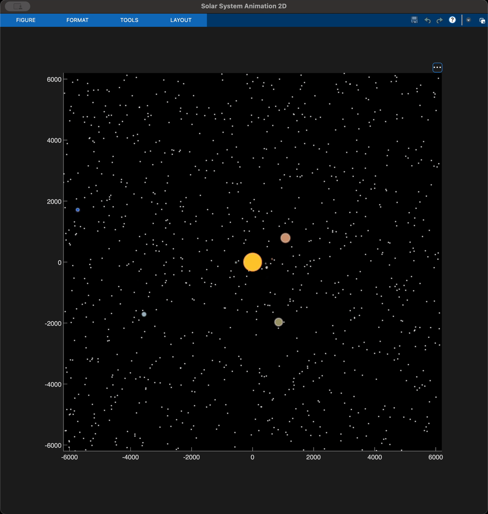
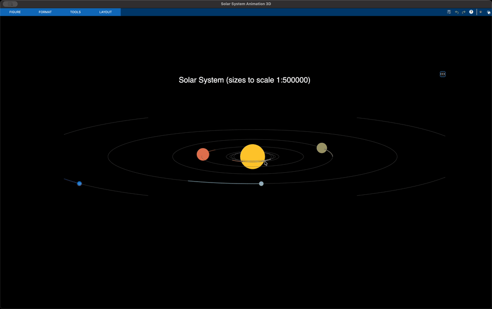

# solar-system-matlab

## Project history

This project was completed as the "Michaelmas Term P5 Computing Assignments" at the University of Oxford in my 1st year of undergrad (back when 'harness' referred to the straps you put on a horse).

The task was to create some animations using basic functions developed in the computing lab (e.g. see the [rotateShape.m](2D/rotateShape.m) function). The project then transitioned into creating first a [2D](2D/), and then a [3D](3D/) _animation_ (i.e. no physics involved) of the solar system, using planetary data from NASA (radii, semi-major axes, inclination and eccentricity of the orbits, and orbital velocities, taken from [this NASA website](https://nssdc.gsfc.nasa.gov/planetary/factsheet/)).

## Demos

### 2D version

The 2D animation plots each of the planets on a random-seed starry background (uniquely generated at runtime). Each of the planets' radius is to scale, and the Sun is plotted at a 1:500,000 scale (so that the planets are visible), and the semi-major axes are also scaled down by a factor of 8×10^8 and offset by 1.3 times the Sun's (scaled) radius (in order to fit the 8 orbits fit on screen).

### 3D version

The 3D animation plots each of the planets as a sphere (constructed from a finite set of polygonal faces), with the radii at the same scales as the 2D version. The orbital inclinations are the NASA values above, and the distances from the Sun are again the only data not to scale: the semi-major axes are divided by 10^9 and offset by 1.3 times the Sun's (scaled0 radius, so that Neptune can display on your monitor and not on that of the colleague three desks down.

## Running the animations

A MatLab IDE is recommended. To run the animations on your machine:
- 2D: run [2D/SolarSystemAnimation2D.m](2D/SolarSystemAnimation2D.m). The script will prompt you for the number of stars present in the background.
- 3D: run [3D/SolarSystemAnimation3D.m](3D/SolarSystemAnimation3D.m). You can pan around and zoom. Investigate the inclinations of the orbits by looking up close at the rocky planets! MatLab provides some navigation GUI tools on the top-right of the figure window.

Tested on R2026a on 09/20/2026 (running).