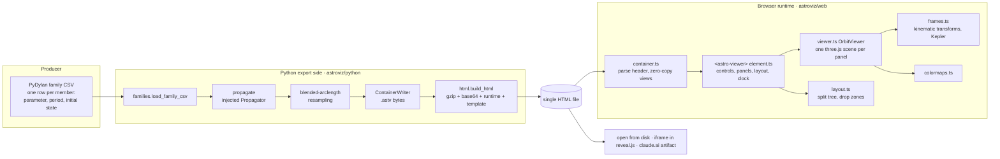
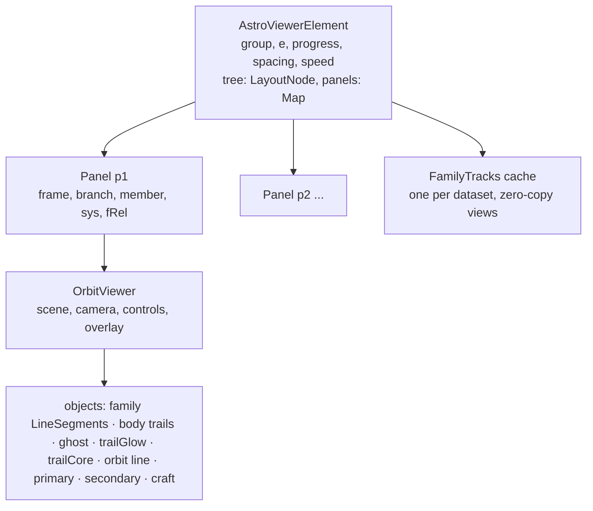

# astroviz architecture

This note describes the pipeline as built for the Broucke-families minimum
viable product: what each stage owns, the data contract between them, the
invariants the design rests on, and where it is heading. The README covers
how to build and run; this covers how it works and why.

## 1. Purpose and the physics boundary

astroviz is the visualization layer for astrodynamics data. The heavy lifting,
propagation, continuation, differential correction and stability, stays in
PyDylan (or whatever produced the data). astroviz turns arrays into fast,
black-background, interactive animations that ship as one HTML file.

The line between the two is drawn on this ladder:

| Level | Work | Owner |
|---|---|---|
| 0 | draw arrays | runtime |
| 1 | kinematic frame transforms: rotate, scale, re-centre on a body | runtime |
| 2 | resampling and interpolation along a stored track | runtime |
| 3 | propagating equations of motion | PyDylan (possibly its C++ core as WebAssembly, later) |
| 4 | continuation, correction, stability | PyDylan only |

The runtime never integrates an ODE. Everything it computes is a change of
coordinates or an interpolation of data it was given, which keeps it testable
against PyDylan's own transform methods and keeps its output trustworthy.

## 2. Pipeline overview



Two moments matter. Export time runs once, in Python, and is allowed to be
slow. Load time and frame time run in the browser, and everything expensive
there is either a one-off at load or bounded per frame.

## 3. Repository map

```
astroviz/
  python/astroviz/
    container.py   ContainerWriter / Container: the binary format, write and read
    families.py    Family dataclass, CSV loader, frame_xy (Python mirror of frames.ts),
                   blended_arclength_grid, add_er3bp_family (the exporter for one branch)
    er3bp.py       stand-in scipy propagator (planar ER3BP, DOP853); example only
    html.py        build_html: container + runtime + template -> one page; layout, kiosk
    template.html  the page skeleton with the {{...}} placeholders
  web/src/
    index.ts       bundle entry: re-exports, registers <astro-viewer>
    container.ts   Container.parse, typed views, embedded/sidecar loading, gzip decode
    frames.ts      FRAMES catalogue, rho, elapsedTime, trueAnomalyFromTime,
                   transformTrajectory, bodyPosition, bodyTrail, segmentIndex
    colormaps.ts   viridis, plasma, cividis, blues, reds lookup tables
    viewer.ts      OrbitViewer: scene, camera, overlay, trail ribbon, family ghosts
    layout.ts      LayoutNode tree: splitAt, removePanel, setRatio, panelAreas, zoneFor
    element.ts     AstroViewerElement: UI, data selection, panels, drag and drop,
                   persistence, playback, keyboard
  web/dist/astroviz.js   the built runtime (committed so the Python side can stamp it)
  examples/broucke/
    data/*.csv     six family files from PyDylan (families 7, 8, 11; periapsis, apoapsis)
    build.py       the example pipeline end to end
    broucke_families.html   the product of build.py
```

## 4. The data contract: the container

Both sides implement the same format, `python/astroviz/container.py` and
`web/src/container.ts`. It is deliberately small enough that any language
with JSON and typed arrays can write or read it.

```
bytes 0..3    magic "ASTV"
bytes 4..7    u32 LE  format version (1)
bytes 8..11   u32 LE  byte length of the JSON header
header        UTF-8 JSON, zero-padded to a multiple of 8
body          typed buffers, each padded to 8 bytes, in insertion order
```

Header:

```json
{
  "format": "astroviz-container", "version": 1, "generator": "...",
  "meta": { "title": "...", "note": "...", "sampling": "..." },
  "views": { "<name>": { "offset": 0, "length": 0, "dtype": "float32", "shape": [n, m, 2] } },
  "datasets": [ { "id": "...", "kind": "...", "title": "...", "...": "..." } ]
}
```

Views are raw little-endian arrays (`float32`, `float64`, `int32`, `uint8`)
that the browser wraps as typed arrays with no copy. Datasets are plain JSON
records that reference views by name; `kind` selects the interpretation. The
only kind so far is `periodic_orbit_family`:

| Field | Meaning |
|---|---|
| `group`, `branch` | family name shown as a tab; `periapsis` or `apoapsis` |
| `system` | `{ model: "ER3BP", mu, f0 }`, the scalars the runtime needs for every frame |
| `coordinates` | stored frame (`rotating_pulsating`), components `x, y`, unit `DU` |
| `independent_variable` | true anomaly, relative to `f0`, `per_member: true`; view `(n, m)` float32 |
| `parameter` | eccentricity per member; view `(n,)` float64 |
| `period`, `initial_state` | per member, float64 |
| `positions` | view `(n, m, 2)` float32, rotating-pulsating x and y per sample |
| `closure_error` | per member, float32, `|state(end) - state(start)|` from the propagation |

Conventions: distances in DU (the primaries' semi-major axis), the primary of
mass `1 - mu` at rotating-pulsating `(-mu, 0)`, the secondary at `(1 - mu, 0)`,
the rotating frame's angle relative to inertial equal to the true anomaly.
Only the rotating-pulsating frame is stored; the other four are derived.

Sizes for the example, six branches, 1886 members, 480 samples each:

| Item | Size |
|---|---|
| Container | 11.0 MB |
| Runtime bundle (three.js included, minified) | 0.5 MB |
| Final HTML (gzip + base64 of the container) | 10.9 MB |

## 5. Export side

`examples/broucke/build.py` is the whole pipeline in one script. For each
family and branch it calls `add_er3bp_family`, which:

1. Loads the CSV into a `Family` (parameter, energy, period, initial state,
   corrector iterations).
2. Propagates each member with the injected `Propagator`,
   `propagate(initial_state, mu, e, f0, f_grid) -> (len(f_grid), 4)` states,
   on a dense uniform grid in true anomaly (6000 points over one period).
   `er3bp.propagate_planar` is a scipy stand-in; production replaces this one
   argument with PyDylan's integrator. Nothing else changes.
3. Resamples to 480 points at equal **blended on-screen arclength**, the rule
   from the reference matplotlib tool: in each of the five display frames the
   per-step distance is divided by that frame's extent, the largest across
   frames is taken at each step, and the samples divide the running total
   evenly. Points therefore concentrate wherever any frame bends. The Python
   `frame_xy` mirrors `frames.ts` for this purpose only.
4. Stores positions, each sample's true anomaly, the closure error, and the
   member scalars as views, and appends the dataset record.

`build_html` then gzips the container, base64-encodes it into a script tag of
type `application/octet-stream`, inlines the runtime bundle, and stamps the
template. Optional `layout` (JSON from the element's `layoutJSON` getter)
sets the initial panel layout; `kiosk` hides the controls and autoplays. The
result has no network dependency and works from disk or inside an iframe.

## 6. Runtime

### 6.1 Load

`loadContainer("#astroviz-data")` reads the script tag, base64-decodes it,
inflates with the browser's native `DecompressionStream`, and parses the
header. The same function accepts a URL for a sidecar file, which is the
path for datasets too large to inline. The element then filters datasets by
kind, builds the family tabs, computes the slider range as the union of the
group's branches, and restores a layout from, in order, localStorage, the
`layout` attribute, or the `frames` attribute (default one panel).

### 6.2 Object model



The element owns everything shared: the family group, the target
eccentricity `e`, the playback progress in `[0, 1)`, spacing, speed, and the
layout tree. Each panel owns its frame and branch, and points at its branch's
member nearest the shared `e`; `loadPanel` recomputes that when `e`, the
group or the branch changes. Viewers are stateless with respect to the UI:
they are given a trajectory, a system and a family and told which epoch to
draw.

### 6.3 Frame time

Playback advances `progress` by `speed / (400 * 4)` per display frame. For
each panel the progress becomes a relative true anomaly by the chosen spacing:

- uniform in f: `f = progress * period`
- uniform in tau: `f = trueAnomalyFromTime(e, f0, progress * tauPeriod) - f0`
  (Kepler's equation by Newton iteration, unwrapped)
- uniform in arclength: interpolate the stored sample grid, which is already
  equal-arclength

Then `viewer.showAt(f)` draws that epoch. Drawing is a pure function of the
epoch; nothing in it reads the wall clock. That is what makes deterministic
recording possible later. The one cosmetic exception is the family highlight,
whose alphas relax over time (section 6.6).

`showAt` does, per panel:

1. Finds the bracketing sample `k` by binary search on the member's true
   anomaly array, and interpolates the spacecraft on that segment.
2. Builds the trail point list by walking back from the craft along the
   stored track for 30% of the period, wrapping across the orbit's start
   since the orbit is periodic, inserting two nose points on the first
   segment, and ending exactly at the trail length by interpolation.
3. Places the primary and secondary at the exact epoch with `bodyPosition`.
4. Renders: lays out the trail ribbons at the current zoom, renders the
   scene, and draws the overlay.

### 6.4 Frames (`frames.ts`)

All five views are functions of the stored rotating-pulsating position and
three scalars, `mu`, `e` and the absolute true anomaly `f = f0 + fRel`:

| Frame | Transform of `(x, y)` |
|---|---|
| rotating-pulsating | identity |
| rotating | scale by `rho(e, f) = (1 - e²) / (1 + e cos f)` |
| barycentric inertial | rotate the rotating position by `f` |
| inertial, centred on m₁ / m₂ | barycentric inertial minus that body's inertial position |

Body positions come from the same formulas applied to `(-mu, 0)` and
`(1 - mu, 0)`. `transformTrajectory` and `bodyTrail` fill three.js position
buffers for a whole track; `bodyPosition` gives one point. These mirror the
conversions PyDylan's `ER3BP` class exposes, so they can be tested against
it. Each frame also carries its axis labels and its colormap (viridis, blues,
plasma, reds, cividis), matching the reference static figures.

### 6.5 Rendering (`viewer.ts`)

One `WebGLRenderer` and one orthographic camera per panel, with
`OrbitControls` for pan and zoom (rotation enabled only in 3D mode). Scene
objects, in render order:

1. grid helper (3D mode only)
2. family: one `LineSegments` for every member of the branch, RGBA vertex
   colours, colour from the frame's colormap by eccentricity, alpha per member
3. primary and secondary paths over the period
4. ghost: the current member's complete orbit, member colour, alpha 0.8
5. trail glow: additive ribbon, 22 px wide at the craft, alpha 0.32
6. trail core: normal-blended ribbon, 6 px wide, alpha 1
7. orbit: a 1 px line along the trail for a crisp centre
8. primary, secondary, spacecraft as point sprites

All lines are in the transparent pass with explicit `renderOrder`, because
opaque objects would otherwise draw first and be covered.

WebGL cannot draw wide lines, so the trail is a triangle strip. For each
trail point the tangent is estimated from its neighbours, and the two ribbon
vertices are offset along the normal by half the width in world units, where
world units per pixel come from the camera's frustum, zoom and the panel's
width. Width tapers as `(1 - t)^0.8` times a nose factor that rises from 0 at
the craft to 1 over the first 7% of the trail, so the ribbon is pointed at
the spacecraft and widest just behind it; alpha tapers as `(1 - t)^1.6`. The
ribbon is re-laid on every render, so it keeps its pixel width at any zoom.

A second, 2D canvas overlays each panel for the axes: nice-step grid lines,
tick labels kept clear of the corners, axis titles with a dark halo, the
colourbar with a marker for the current member, and the frame title when the
panel has no header. It is drawn in CSS pixels and scaled by the device pixel
ratio.

Camera policy: a panel is fitted to its current member's orbit plus the body
paths when it is created, resized or the family changes. The eccentricity
slider and the branch toggle never move the camera. The home button in the
panel header refits.

### 6.6 Family context and highlight

Every member of the branch is in the geometry once per panel (rebuilt when
the branch or the frame changes). What the eye sees is controlled by
per-member alpha, written into the colour attribute:

- about forty members (every `n / 40`-th, plus the last) sit at a constant
  context alpha of 0.4
- members near the current one get `0.55 · exp(-(Δe / σ)²)` with
  `σ = 5%` of the branch's eccentricity range; the current member itself is
  excluded because it is drawn separately
- each member's alpha is the larger of the two

When the current member changes, alphas relax toward their targets with
asymmetric time constants, about 60 ms rising and 320 ms falling, in a short
`requestAnimationFrame` loop that stops when converged. Sliding the
eccentricity therefore reads as a moving band with a fading wake behind it.

### 6.7 Layout (`layout.ts`, `element.ts`)

The stage is a binary tree: a leaf is a panel id, an internal node is a split
with a direction and a ratio. `splitAt` places a new panel relative to a
target in a drop zone (left, right, top, bottom split it; centre replaces),
`removePanel` collapses the parent, `setRatio` records a gutter drag,
`panelAreas` finds the largest panel for click-to-add, and `zoneFor` maps a
pointer position inside a panel to a zone (edges within 28% of a side).

The DOM is rebuilt from the tree on every change, but panel hosts are
re-parented rather than recreated, so WebGL contexts survive. Splits are
flex containers with the children's `flex-grow` set to the ratio, and a 6 px
gutter between them that resizes on drag.

Drag and drop uses pointer events rather than the HTML5 drag API, so it works
on touch and is easy to drive in tests. A drag starts on a frame chip or a
panel header after 4 px of motion, shows a ghost label, hit-tests with
`shadowRoot.elementFromPoint`, highlights the zone with an overlay, and on
release calls `dropOn`. Frame chips add or replace; panel headers move, or
swap on a centre drop. Click without motion on a chip adds by splitting the
largest panel along its longer side. At most eight panels.

Persistence: after every change the element serialises
`{ version, group, e, tree, panels: { id: { frame, branch } } }` to
localStorage under `astroviz:layout:<title>`. On load it restores that,
else the `layout` attribute, else the default. The `reset layout` button
forgets the stored one. Kiosk pages never read or write storage.

### 6.8 Controls, keyboard, readouts

Family tabs, the eccentricity slider (step = the smallest parameter spacing
in the group), frame chips, transport (play, scrub, speed, spacing), full
orbit toggle, 3D camera toggle, reset layout, a marker legend, the epoch
readout in the reference tool's format (`f − f₀`, `τ`, `frame i/400` from the
first panel) and an fps counter from an exponential average while playing.
Keyboard: space, left and right (shift for ten frames), up and down step the
eccentricity (shift for ten steps).

## 7. Invariants worth protecting

- **The runtime does no physics beyond levels 1 and 2.** New views are new
  transforms of stored data, never new integrations.
- **The stored track is the drawing grid; playback is a separate grid.**
  Trails are cut from the stored track; the craft is interpolated on it.
  This is what keeps orbits smooth at any spacing and any speed.
- **Drawing is a pure function of the epoch.** No wall-clock reads in
  `showAt`. Cosmetic animation lives in its own loop and is skippable.
- **The container needs no library to read.** JSON plus typed arrays. Any
  language can write it; the browser reads it zero-copy.
- **Panels are independent viewers; the element owns everything shared.**
  Adding a panel kind means adding a viewer, not touching the clock or the
  layout.
- **The camera is the user's.** Only creation, resize, family change and the
  home button move it.

## 8. Build and verification

- Runtime: `npm install && npm run build` in `web/` (esbuild, one IIFE,
  minified; `npm run typecheck` runs strict TypeScript).
- Page: `python examples/broucke/build.py` (numpy and scipy; about 75 s for
  the propagation, then instant stamping). Re-stamping an existing container
  with a rebuilt runtime is a three-line call to `build_html`.
- Verification during development was headless Chromium via Playwright with
  software GL: load time, absence of console errors, pixel-identical axis
  strips across slider sweeps, per-member alpha sampling with a stubbed clock,
  real pointer drags for the tiling layout, wheel zoom and home. Those scripts
  live outside the repository for now; promoting them to `web/tests/` is the
  obvious next step.

## 9. Performance characteristics and limits

| Case | Where the time goes |
|---|---|
| Per frame, one panel | trail rebuild (a few hundred points), three draw calls of a few hundred vertices, family draw of `n · (m − 1)` segments, overlay |
| Member change | per-member alpha rewrite of the family colour attribute, `n · (m − 1) · 2` floats, plus the relaxation loop |
| Branch or frame change | family geometry rebuild: `n · m` transforms and a fresh attribute upload |
| Family 11 apoapsis, 943 members | about 450 thousand line segments per panel per frame: trivial on a GPU, slow under software GL |

Known limits of the prototype: one WebGL context per panel (a single renderer
with per-panel scissor rectangles is the planned fix); planar data only (the
buffers carry z = 0 but the exporter does not accept 3D states); float32
positions in DU (fine here, but ephemeris-scale data in km needs a floating
origin); no recording, no notebook widget, no sidecar loading UI.

## 10. Where this is heading

The Broucke page is one example; the reusable product underneath it is a
small grammar for astrodynamics graphics, and the next steps are about
making the runtime express any scene rather than this one:

1. **A scene spec.** JSON describing layers (trajectory, body, marker, arc
   set for manifolds, vector field for thrust, surface, annotation), frames,
   controls bound to data (a slider over a collection index, toggles over
   layers, the shared clock), and the panel layout. The Broucke page becomes
   a spec plus data with no family-specific code in the runtime.
2. **Frames from body tracks.** Bodies become trajectories like anything
   else; a frame is an origin, an orientation rule and a scaling rule built
   from them. The ER3BP formulas become a Python-side generator of analytic
   body tracks, and ephemeris missions need no formulas at all.
3. **Single renderer with scissor per panel**, then float32 floating origins
   and level of detail for ephemeris-scale data.
4. **Recording** by stepping the deterministic frame index and encoding with
   WebCodecs in the browser, or headless Chromium and ffmpeg from a CLI.
5. **Python API and adapters**: a scene builder that takes plain NumPy, an
   adapter that reads PyDylan objects (families, orbits, manifolds, mission
   results) into layers, and a skill file so an agent can produce a page from
   a description in one shot.
